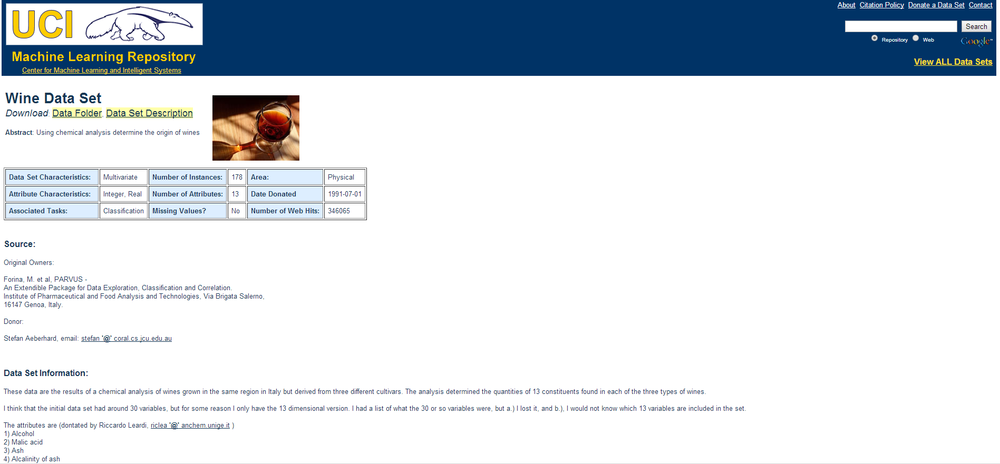
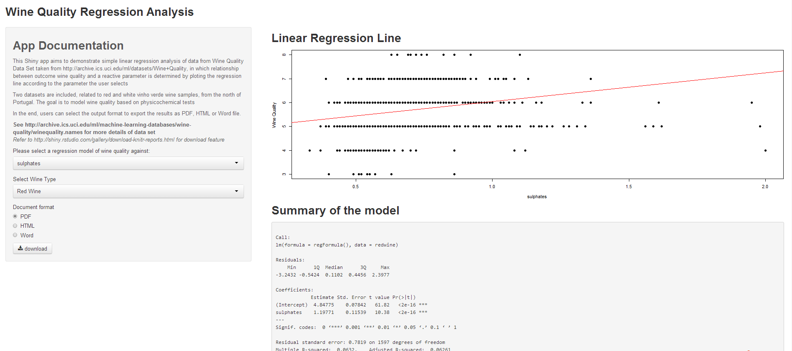
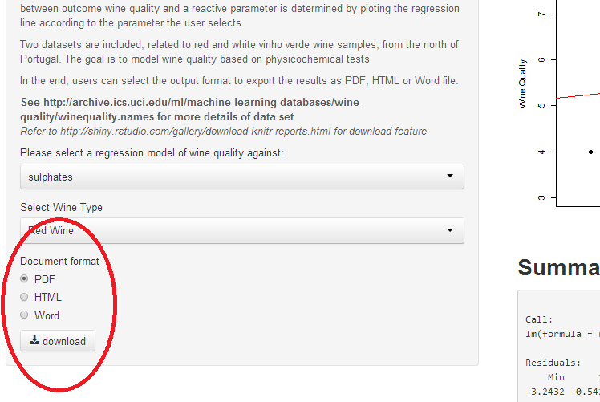
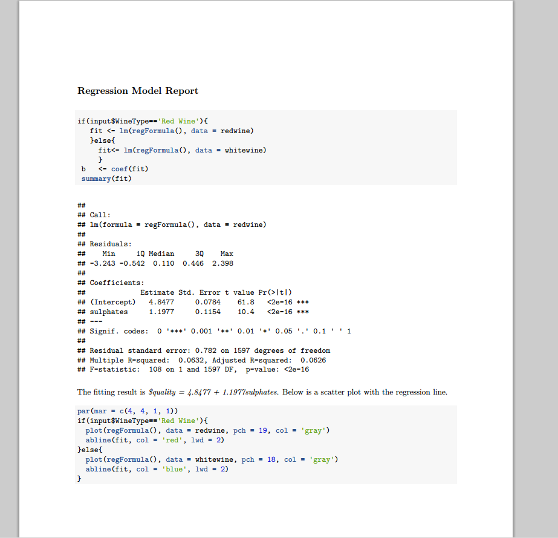

## Wine Quality Datasets
> - Taken from https://archive.ics.uci.edu/ml/datasets/Wine
aut

--- .class #id 

## Single Variable Linear Regression

--- .class #id 

## 3 select input, 1 plot, 1 summary, 1 downloadable output 
> - a preditor, alcohol, pH 

> - wine data set ( Red or White wine)

> - if you'd like, downloadable output available

--- .class #id 

## Download Output as PDF, HTML or WORD
> - Users can select the output( plot and summary) format

--- .class #id

##  Output Sample
> - PDF format

